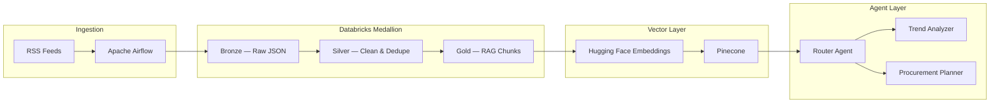

# News Insight Engine

**Live News-to-Insight Engine** — a production-oriented, multi-agent RAG platform that ingests global news feeds, processes them through a Databricks medallion lakehouse, embeds content into Pinecone, and delivers actionable insights through specialized AI agents.

Built for teams that need **real-time market intelligence**, **supply-chain risk signals**, and **observable LLM workflows** at scale.

---

## Overview

News Insight Engine connects orchestration, data engineering, vector search, and agentic AI into a single pipeline:



Every stage is traced end-to-end with **Langfuse** — from feed ingestion and embedding batches to retrieval and LLM generation.

---

## Features

| Capability | Description |
|---|---|
| **Multi-source ingestion** | Configurable RSS feeds with regional tagging (global, EMEA, Americas) |
| **Medallion architecture** | Bronze → Silver → Gold Delta tables on Databricks Unity Catalog |
| **Multilingual embeddings** | `paraphrase-multilingual-MiniLM-L12-v2` (384-dim) via Hugging Face |
| **Regional vector search** | Pinecone namespaces per region with metadata filters |
| **Multi-agent routing** | Intent-based dispatch to Trend Analyzer or Procurement Planner |
| **Full observability** | Langfuse spans on Airflow tasks, Spark jobs, embed batches, and agent calls |
| **Local development** | Offline ingest and demo scripts — no cloud keys required for smoke tests |

---

## Tech Stack

| Layer | Technology |
|---|---|
| Orchestration | Apache Airflow |
| Lakehouse | Databricks Delta (Bronze / Silver / Gold) |
| Embeddings | Hugging Face Sentence Transformers |
| Vector DB | Pinecone |
| Agents & LLM | OpenAI (`gpt-4o-mini`) |
| Observability | Langfuse |
| Config | Pydantic Settings, YAML feed registry |

---

## Project Structure

```
News-Insight/
├── dags/                    # Airflow DAGs — RSS ingest + Databricks trigger
├── databricks/
│   ├── schemas/             # Bronze, Silver, Gold DDL
│   ├── src/                 # PySpark medallion jobs
│   └── databricks.yml       # Databricks Asset Bundle
├── vector/                  # HF embedding + Pinecone upsert pipeline
├── agents/                  # Router, Trend Analyzer, Procurement Planner
├── observability/           # Langfuse tracing helpers
├── config/                  # Settings + feed registry (feeds.yaml)
├── scripts/                 # Local ingest & offline demo utilities
├── run_insight.py           # CLI entrypoint for agent queries
├── requirements.txt
└── .env.example
```

---

## Quick Start

### Prerequisites

- Python 3.10+
- (Optional) Databricks workspace, Pinecone account, OpenAI API key, Langfuse project

### 1. Clone & install

```bash
git clone https://github.com/achrafS133/News-Insight.git
cd News-Insight

python -m venv .venv
.venv\Scripts\activate        # Windows
# source .venv/bin/activate   # macOS / Linux

pip install -r requirements.txt
cp .env.example .env          # fill in your secrets
```

### 2. Run locally (no cloud keys)

```bash
python scripts/run_ingest_local.py
python scripts/run_offline_demo.py "procurement supply chain risks"
```

### 3. Query the agent stack

```bash
python run_insight.py "What supply chain risks are emerging in EMEA electronics?"
python run_insight.py "Summarize bullish trends in global energy markets" --region global
```

---

## Deployment

### Databricks — create schemas

Run the SQL files in `databricks/schemas/` against your Unity Catalog (replace `${catalog}` with your catalog name).

### Databricks Asset Bundle

```bash
cd databricks
databricks bundle validate --target dev
databricks bundle deploy --target dev
```

Set `cluster_id` in `databricks.yml` or via target variables before deploying.

### Airflow

1. Copy `dags/` into your Airflow `dags/` folder (or point `DAGS_FOLDER` here).
2. Configure Airflow Variables:
   - `news_insight_medallion_job_id` — Databricks job ID from bundle deploy
   - `news_insight_bronze_staging_uri` — staging path for JSONL output
3. Add a `databricks_default` connection with host, token, and job ID.

### Pinecone

The index is auto-created on first embed run (cosine metric, **384** dimensions). Namespaces map to feed regions: `global`, `emea`, `americas`.

---

## Pipeline Flow

1. **Airflow** (`@hourly`) — fetches RSS feeds → writes JSONL staging → triggers Databricks medallion job
2. **Bronze** — appends raw articles to `catalog.bronze.raw_news`
3. **Silver** — cleans, hash-deduplicates, tags language → `catalog.silver.cleaned_news`
4. **Gold** — sliding word-window chunks → `catalog.gold.rag_chunks`
5. **Vector job** — embeds batches → upserts to Pinecone → marks `embedded_at` on Gold
6. **Agents** — router classifies intent → specialist RAG retrieval + OpenAI JSON response

---

## Configuration

All secrets and runtime settings live in `.env`. See [`.env.example`](.env.example) for the full list.

| Variable | Purpose |
|---|---|
| `DATABRICKS_HOST` / `DATABRICKS_TOKEN` | Databricks workspace access |
| `PINECONE_API_KEY` / `PINECONE_INDEX_NAME` | Vector store |
| `OPENAI_API_KEY` / `OPENAI_MODEL` | Agent LLM calls |
| `LANGFUSE_PUBLIC_KEY` / `LANGFUSE_SECRET_KEY` | Observability |
| `EMBEDDING_MODEL_NAME` | HF model (default: multilingual MiniLM) |

Feed sources are defined in [`config/feeds.yaml`](config/feeds.yaml) — add or remove RSS endpoints without code changes.

---

## Observability

Langfuse traces cover the full request lifecycle:

| Span | Stage |
|---|---|
| `airflow-fetch-feeds` | RSS ingestion |
| `hf-embed-batch` | Embedding generation |
| `pinecone-query` | Vector retrieval |
| `router-handle` | Intent classification |
| `agent-llm-generation` | Specialist LLM response |

---

## Author

**Achraf S.** — [github.com/achrafS133](https://github.com/achrafS133)

---

## License

This project is provided as-is for portfolio and production use. Add a license file if you plan to open-source contributions.
